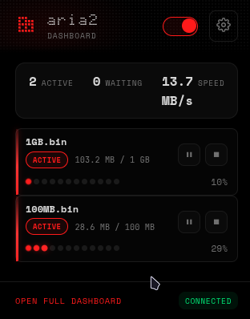
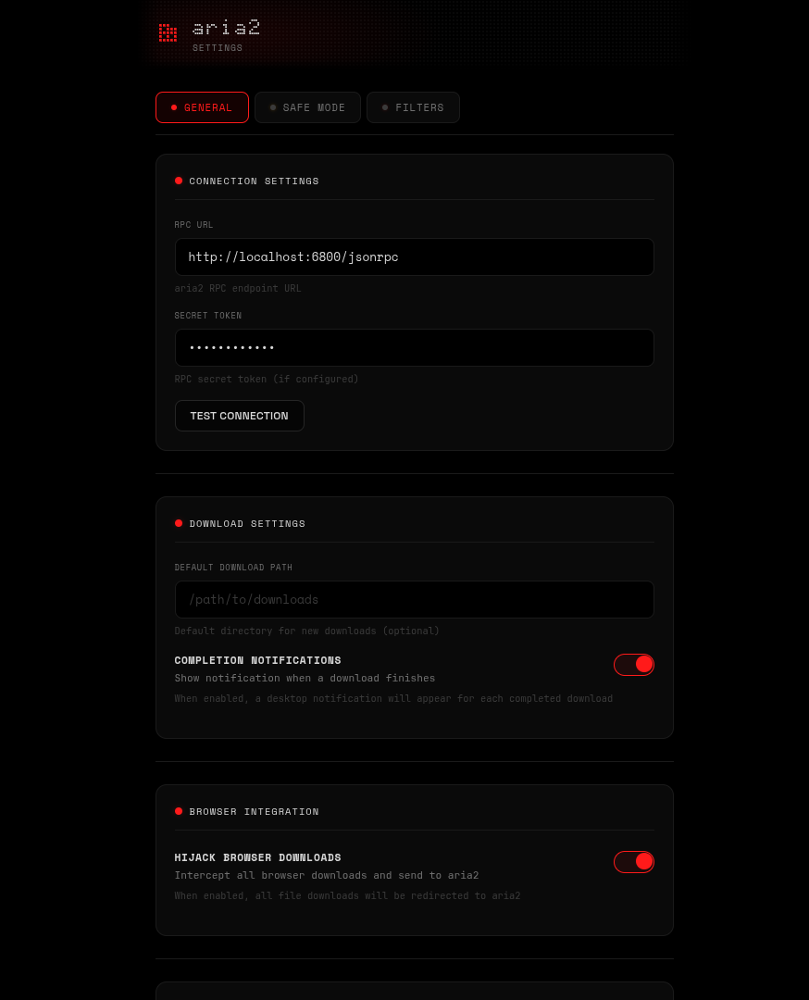
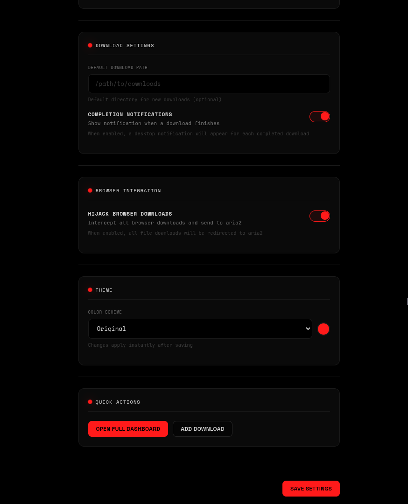

# Aria2 Dashboard

A browser extension for managing aria2 downloads with a sleek dot-matrix aesthetic and real-time updates. Supports both Chrome and Firefox.







## Features

- **Real-Time Updates**: Live download progress, speed, and status — refreshes continuously via recursive polling
- **Download Management**: View, pause, resume, stop, and remove downloads
- **Queue Reordering**: Move waiting downloads up and down the queue
- **Browser Integration**: Hijack browser downloads and send them directly to aria2
- **Badge Notifications**: Active download count shown on the extension icon
- **Site Interception**: Auto-detect download URLs from 30+ file hosting sites (Gofile, 1Fichier, Pixeldrain, MediaFire, RapidGator, etc.)
- **Safe Mode**: Toggle to force single-connection downloads for rate-limited hosts — prevents 429 errors and connection drops
- **Safe Mode Site Management**: Add and remove sites from the safe mode list directly in the options UI — no code editing required
- **Shared Options**: Popup and full dashboard share the same options page with tabbed navigation (General + Safe Mode)
- **Dot-Matrix Aesthetic**: Dark theme with monospace fonts, red accents, and fluid animations (liquid progress bars, sonar rings, spring row entrances, ambient glows)
- **Modular Theming**: All colors, fonts, and sizing live in `src/theme.css` — retheme the entire extension by editing one file
- **Toggleable Hijacking**: Enable/disable browser download interception
- **RPC Authentication**: Support for aria2 secret tokens
- **Cookie Forwarding**: Automatically sends cookies and referrer to aria2 for authenticated downloads

## Installation

### Chrome

1. Clone this repository
2. Open Chrome and go to `chrome://extensions/`
3. Enable "Developer mode"
4. Click "Load unpacked"
5. Select the root folder of this repository

### Firefox

1. Clone this repository
2. Open Firefox and go to `about:debugging`
3. Click "This Firefox" → "Load Temporary Add-on"
4. Select `firefox/manifest.json` in this repository

**Note:** Firefox temporary add-ons are removed when the browser closes. For permanent installation, the extension needs to be signed by Mozilla and distributed via [AMO](https://addons.mozilla.org/).

### From Release

1. Download a version from release
2. Extract it
3. Follow steps 2-5 from above

## Install aria2

### Quick Install (recommended)

Run the installer script — it detects your OS, installs aria2, and starts it with RPC enabled:

**Linux / macOS:**
```bash
./install-aria2.sh
```

**Windows (PowerShell, run as Administrator):**
```powershell
.\install-aria2.ps1
```

You can pass a custom RPC secret as an argument:
```bash
./install-aria2.sh my-secret-token
```
```powershell
.\install-aria2.ps1 my-secret-token
```

The script will:
1. Detect your package manager (apt, pacman, dnf, brew) or download the Windows binary from GitHub
2. Install aria2
3. Start aria2 with RPC on port 6800
4. Print the RPC URL and secret to use in the extension

### Manual Install

If you prefer to install manually:

**Linux:**

- Arch Linux / CachyOS:
  ```bash
  sudo pacman -S aria2
  ```
- Debian / Ubuntu:
  ```bash
  sudo apt update && sudo apt install -y aria2
  ```
- Fedora:
  ```bash
  sudo dnf install -y aria2
  ```

**macOS:**

Install with Homebrew:
```bash
brew install aria2
```

**Windows:**

- Install with Winget:
  ```powershell
  winget install aria2.aria2
  ```
- Or with Chocolatey:
  ```powershell
  choco install aria2
  ```
- Or download from [GitHub releases](https://github.com/aria2/aria2/releases)

### Start aria2 with RPC enabled (required)

Quick start:
```bash
aria2c --enable-rpc --rpc-listen-all=false --rpc-listen-port=6800 --rpc-secret="change-me"
```

- Extension default RPC URL: `http://localhost:6800/jsonrpc`
- Put the same secret in extension options (`Secret Token`)

To auto-start aria2 on login, add the command above (with `-D` for daemon mode) to your shell profile on Linux/macOS, or place a shortcut in `%APPDATA%\Microsoft\Windows\Start Menu\Programs\Startup` on Windows.

Optional persistent config (`aria2.conf`):
```ini
enable-rpc=true
rpc-listen-all=false
rpc-listen-port=6800
rpc-secret=change-me
```

Then start aria2 with:
```bash
aria2c --conf-path=/path/to/aria2.conf
```

## Configuration

1. Make sure aria2 is running with RPC enabled:
   ```bash
   aria2c --enable-rpc --rpc-listen-all=false --rpc-listen-port=6800
   ```

2. Click the extension icon and open Options
3. Set your RPC URL (default: `http://localhost:6800/jsonrpc`)
4. Enter your secret token if configured
5. Test the connection

### Safe Mode

When enabled (default), downloads from known restrictive file hosts are sent to aria2 with:
- `max-connection-per-server: 1` — single connection to avoid rate limits
- `split: 1` — no chunk splitting
- `enable-http-pipelining: false` — prevents connection drops on some CDNs

This prevents 429 (Too Many Requests) errors and connection drops that occur when aria2's optimized multi-connection settings hammer rate-limited servers.

#### Managing Safe Mode Sites

Safe mode sites are managed through the options page:

1. Open the extension options (gear icon from popup, or from the full dashboard)
2. Switch to the **Safe Mode** tab
3. Toggle safe mode on/off
4. View all sites currently in the safe mode list
5. Add new sites by typing a domain (e.g. `example.com`) and clicking "add" or pressing Enter
6. Remove sites by clicking the X button on any site chip

Changes take effect immediately — no need to save or reload.

To add a new site for content script interception (auto-detecting download URLs), you still need to add a regex pattern to `siteInterceptors` in `src/content.js`. However, adding a domain to the safe mode list only requires the options UI — if you're already intercepting the URL through hijack or context menu, safe mode will apply automatically.

## Usage

### Popup Panel
- Quick view of active and waiting downloads
- Compact stats (active, waiting, speed)
- Toggle download hijacking
- Action buttons for each download (pause, resume, stop, reorder)
- Gear icon opens the shared options page in a new tab

### Full Dashboard
- Complete download management
- Tabbed interface (active/waiting/stopped)
- Reorder waiting downloads (move up/down in queue)
- Gear icon opens embedded options panel (General + Safe Mode tabs)
- Real-time updates

### Options Page
- **General tab**: RPC URL, secret token, download path, hijack toggle, test connection, quick actions
- **Safe Mode tab**: Safe mode toggle, managed sites list with add/remove
- Accessible from popup (gear icon), full dashboard (gear icon), or `chrome://extensions` → options

### Download Hijacking
Enable "Hijack Downloads" to intercept browser downloads and send them to aria2 automatically.

**How it works:**
- Uses the downloads API to intercept browser downloads
- Content script monitors fetch/XHR responses for hidden download URLs from file hosting sites
- Extracts cookies and forwards them to aria2
- Sends referrer and cookie headers so authenticated sites (e.g. Gofile) work correctly
- Right-click any link and select "Download with aria2"

### Supported File Hosts (Site Interception)

The content script scans fetch/XHR responses for download URLs from these hosts:

1Fichier, Bowfile, Chomikuj, ClickNUpload, DailyUploads, DataNodes, DayUploads, DL.Free, DownMediaLoad, FileBin, FileDitch, FreedLink, Gofile, HexLoad, 1CloudFile, MediaFire, Mega, MegaUp, MixDrop, NitroFlare, Oshi.at, osu!ppy, Pixeldrain, RapidGator, Ranoz, SwissTransfer, Tmpfiles, UploadNow, UsersDrive, VikingFile, WDHO

## Building

Run the build script to package for both browsers:
```bash
./build.sh
```

This creates:
- `dist/aria2-dashboard-chrome.zip`
- `dist/aria2-dashboard-firefox.zip`

## File Structure

```
├── manifest.json          # Chrome extension manifest
├── build.sh               # Build script for packaging
├── install-aria2.sh       # aria2 installer (Linux/macOS)
├── install-aria2.ps1      # aria2 installer (Windows)
├── src/                   # Shared source files
│   ├── constants.js       # Shared constants (RPC URL, safe mode hosts)
│   ├── background.js      # Chrome service worker
│   ├── content.js         # Content script for site-specific URL interception
│   ├── popup.html/js      # Popup panel
│   ├── options.html/js    # Options page (shared between popup and full dashboard)
│   ├── full.html/js       # Full dashboard (loads options.js for embedded settings)
│   ├── theme.css          # Design tokens — colors, fonts, radii (edit here to retheme)
│   └── style.css          # Structural styles (references theme.css tokens only)
├── icons/                 # Extension icons
├── firefox/               # Firefox-specific files
│   ├── manifest.json      # Firefox manifest (with gecko settings)
│   ├── background.js      # Firefox background script (promise-based APIs)
│   └── icons/             # Copy of extension icons
└── dist/                  # Build output (gitignored)
```

### Chrome vs Firefox Differences

| Aspect | Chrome | Firefox |
|--------|--------|---------|
| Background | Service worker | Background script |
| API style | Callbacks | Promises |
| Download capture | `onChanged` + `onDeterminingFilename` | `onCreated` directly |
| Manifest | `service_worker` | `scripts` array |
| Add-on ID | N/A | `browser_specific_settings.gecko` |

## Permissions

- `storage`: Save settings and safe mode host list
- `activeTab`: Browser integration
- `contextMenus`: Right-click download option
- `notifications`: Download status notifications
- `downloads`: Download interception
- `cookies`: Access cookies for authenticated downloads
- `host_permissions`: Connect to aria2 RPC and access cookies from all sites

## License

MIT

## Troubleshooting

### Downloads failing on certain sites
- Enable **Safe Mode** in options — this forces single-connection downloads for known restrictive hosts
- Make sure the site is in the safe mode list (Options → Safe Mode tab). Add it if missing
- Try using the context menu (right-click → "Download with aria2")
- Ensure the "Hijack Downloads" toggle is enabled
- Check that aria2 is running and connected

### Downloads going to wrong directory
- Set the download path in the extension options page
- If empty, aria2 uses its own `dir` config from `aria2.conf`

### aria2 not connecting
- Ensure aria2 is running with RPC enabled: `aria2c --enable-rpc`
- Check the RPC URL in extension options (default: `http://localhost:6800/jsonrpc`)
- Verify firewall settings allow connections to the RPC port

### Badge not updating
- Badge shows the active download count and updates when the popup or full dashboard is open
- Close and reopen the popup to trigger a refresh if the count seems stale

## Credits

- Fonts: Doto, Space Mono, Space Grotesk (Google Fonts)
- Aria2: [aria2/aria2](https://github.com/aria2/aria2)
