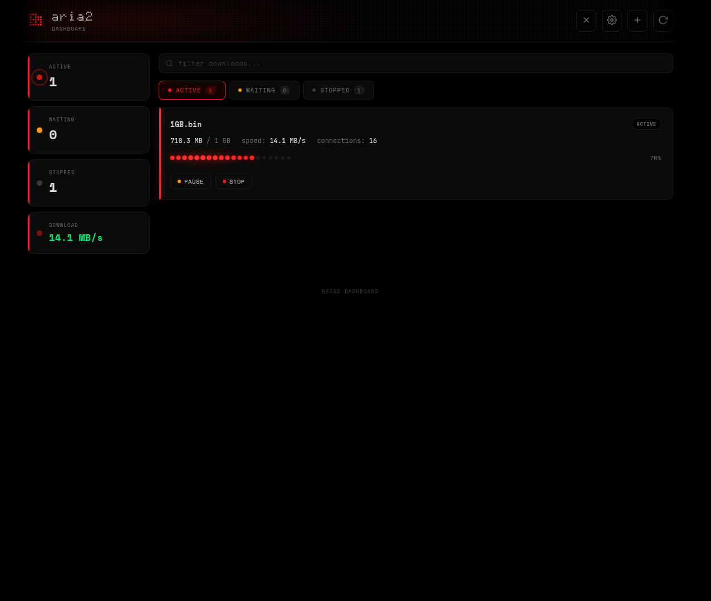

# Aria2 Dashboard

A browser extension for managing aria2 downloads with a sleek dot-matrix aesthetic and real-time updates. Built with Lit 3 + Vite 5 + TypeScript. Supports Chrome and Firefox.




## Features

- **Real-Time Updates**: Live download progress, speed, and status via recursive polling (1s fast / 2.5s idle)
- **Download Management**: View, pause, resume, stop, and remove downloads from popup or full dashboard
- **Queue Reordering**: Move waiting downloads up and down the queue
- **Browser Integration**: Hijack browser downloads and send them directly to aria2
- **Badge Notifications**: Active download count shown on the extension icon
- **Site Interception**: Auto-detect download URLs from 30+ file hosting sites (Gofile, 1Fichier, Pixeldrain, MediaFire, RapidGator, etc.)
- **Safe Mode**: Toggle to force single-connection downloads for rate-limited hosts — prevents 429 errors and connection drops
- **Safe Mode Site Management**: Add and remove sites from the safe mode list directly in the options UI
- **File Extension Filters**: Block specific file types (e.g., `.torrent`, `.exe`) from being captured
- **Custom Themes**: Create and edit custom color themes with a built-in editor (accent, amber, green)
- **Built-in Themes**: Original, Catppuccin, Dracula, Nord, Tokyo Night
- **Dot-Matrix Aesthetic**: Dark theme with monospace fonts, red accents, and fluid animations (liquid progress bars, sonar rings, spring row entrances, ambient glows)
- **Modular Theming**: All CSS custom properties in `src/styles/theme.css` — retheme the entire extension by editing one file
- **Toggleable Hijacking**: Enable/disable browser download interception
- **RPC Authentication**: Support for aria2 secret tokens
- **Cookie Forwarding**: Automatically sends cookies and referrer to aria2 for authenticated downloads

## Installation

### Chrome

1. Clone this repository
2. Run `npm run build:chrome` (or `./build.sh`)
3. Open Chrome and go to `chrome://extensions/`
4. Enable "Developer mode"
5. Click "Load unpacked"
6. Select `dist/chrome/`

### Firefox

1. Clone this repository
2. Run `npm run build:firefox` (or `./build.sh`)
3. Open Firefox and go to `about:debugging`
4. Click "This Firefox" → "Load Temporary Add-on"
5. Select `dist/firefox/manifest.json`

**Note:** Firefox temporary add-ons are removed when the browser closes. For permanent installation, sign via [AMO](https://addons.mozilla.org/).

### From Release

1. Download a release zip
2. Extract it
3. Follow steps 3-5 from Chrome or 3-5 from Firefox above (point to the extracted folder)

## Install aria2

### Quick Install (recommended)

Run the installer script — it detects your OS, installs aria2, and starts it with RPC enabled:

**Linux / macOS:**
```bash
./install-aria2.sh
```

**Windows (PowerShell, run as Administrator):**
```powershell
.\install-aria2.ps1
```

You can pass a custom RPC secret as an argument:
```bash
./install-aria2.sh my-secret-token
```
```powershell
.\install-aria2.ps1 my-secret-token
```

### Manual Install

**Linux:**
- Arch: `sudo pacman -S aria2`
- Debian/Ubuntu: `sudo apt update && sudo apt install -y aria2`
- Fedora: `sudo dnf install -y aria2`

**macOS:** `brew install aria2`

**Windows:** `winget install aria2.aria2` or `choco install aria2`

### Start aria2 with RPC enabled

```bash
aria2c --enable-rpc --rpc-listen-all=false --rpc-listen-port=6800 --rpc-secret="change-me"
```

Extension default RPC URL: `http://localhost:6800/jsonrpc`

## Configuration

1. Make sure aria2 is running with RPC enabled
2. Click the extension icon and open the full dashboard (gear icon)
3. Click the gear icon in the dashboard header to open Settings
4. Set your RPC URL (default: `http://localhost:6800/jsonrpc`)
5. Enter your secret token if configured
6. Test the connection
7. Save settings

### Safe Mode

When enabled (default), downloads from known restrictive file hosts use:
- `max-connection-per-server: 1` — single connection to avoid rate limits
- `split: 1` — no chunk splitting
- `enable-http-pipelining: false` — prevents connection drops

### File Extension Filters

Filters let you exclude specific file types (e.g., `.torrent`, `.exe`) from being captured. Managed through the dashboard's Settings → Filters tab.

### Custom Themes

Create custom color themes through the dashboard's Settings → Themes tab. Built-in themes include Original, Catppuccin, Dracula, Nord, and Tokyo Night.

## Usage

### Popup Panel
- Quick view of active and waiting downloads
- Compact stats (active, waiting, speed)
- Toggle download hijacking
- Action buttons (pause, resume, stop, reorder)
- Gear icon opens the full dashboard (which includes built-in settings)

### Full Dashboard
- Complete download management with sidebar stats
- Tabbed interface (active/waiting/stopped) with search
- Add downloads, reorder queue, refresh
- Gear icon opens the settings panel (connection, safe mode, filters, themes) built into the dashboard
- **Settings tabs**: General (RPC URL, secret token, download path, notifications, hijack toggle, theme), Safe Mode, Filters, Themes

## Building

### Prerequisites

- Node.js >= 18
- npm

### Setup

```bash
npm install
```

### Build

```bash
# Type-check + build for both browsers
npm run build

# Individual builds
npm run build:chrome    # outputs to dist/chrome/
npm run build:firefox   # outputs to dist/firefox/

# Package as .zip
./build.sh              # runs npm builds + creates zips in dist/
```

### Development

```bash
npm run dev             # Vite dev server (for testing HTML pages)
npm run typecheck       # TypeScript type-check only
```

## File Structure

```
├── build.sh                   # Build + package script
├── package.json               # Dependencies: lit, vite, typescript
├── vite.config.ts             # Multi-entry Vite config (popup/full)
├── tsconfig.json              # Strict TypeScript config
├── manifest.lit.json          # Chrome manifest for Lit build (copied as manifest.json)
├── firefox/
│   ├── manifest.json          # Firefox manifest
│   ├── icons/                 # Firefox icons
│   └── background.js          # Firefox background script (promise-based APIs)
├── src/
│   ├── entries/               # HTML entry points for Vite
│   │   ├── popup.html
│   │   └── full.html
│   ├── entries/full.ts        # Full dashboard bootstrap entry
│   ├── components/            # Lit Web Components (light DOM)
│   │   ├── aria2-logo.ts           # Dot-matrix SVG logo
│   │   ├── aria2-chip-list.ts       # Reusable chip list
│   │   ├── aria2-download-row.ts    # Download row (compact + full modes)
│   │   ├── aria2-popup.ts           # Popup view
│   │   ├── aria2-options.ts         # Settings form (embedded in dashboard)
│   │   ├── aria2-theme-editor.ts    # Custom theme editor
│   │   └── aria2-dashboard.ts       # Full dashboard view
│   ├── lib/                   # TypeScript modules
│   │   ├── constants.ts       # Constants + type definitions
│   │   ├── shared.ts          # Config, aria2 RPC, formatting utilities
│   │   └── theme.ts           # Theme engine (apply, compute vars, custom themes)
│   ├── styles/
│   │   ├── theme.css          # Design tokens — colors, fonts, radii
│   │   └── shared.css         # Structural styles
│   ├── background.js          # Chrome service worker (vanilla JS)
│   └── content.js             # Content script (vanilla JS)
├── icons/                     # Extension icons
└── dist/                      # Build output (gitignored)
```

### Chrome vs Firefox Differences

| Aspect | Chrome | Firefox |
|--------|--------|---------|
| Background | Service worker | Background script |
| API style | Callbacks | Promises |
| Download capture | `onChanged` + `onDeterminingFilename` | `onCreated` directly |
| Manifest | `service_worker` | `scripts` array |
| Add-on ID | N/A | `browser_specific_settings.gecko` |

## Permissions

- `storage`: Save settings, safe mode hosts, filter extensions, custom themes
- `activeTab`: Browser integration
- `contextMenus`: Right-click download option
- `notifications`: Download status notifications
- `downloads`: Download interception
- `cookies`: Access cookies for authenticated downloads
- `host_permissions`: Connect to aria2 RPC and access cookies from all sites

## License

MIT

## Credits

- Fonts: Doto, Space Mono, Space Grotesk (Google Fonts)
- Aria2: [aria2/aria2](https://github.com/aria2/aria2)
- Lit 3: [lit.dev](https://lit.dev)
- Vite 5: [vitejs.dev](https://vitejs.dev)